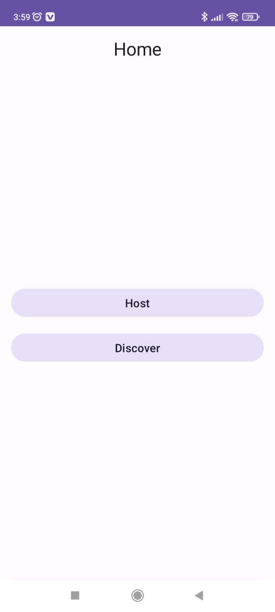
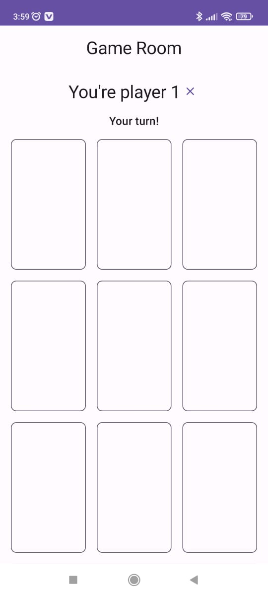
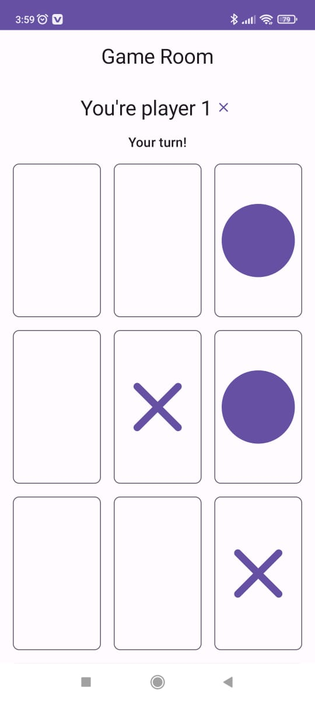
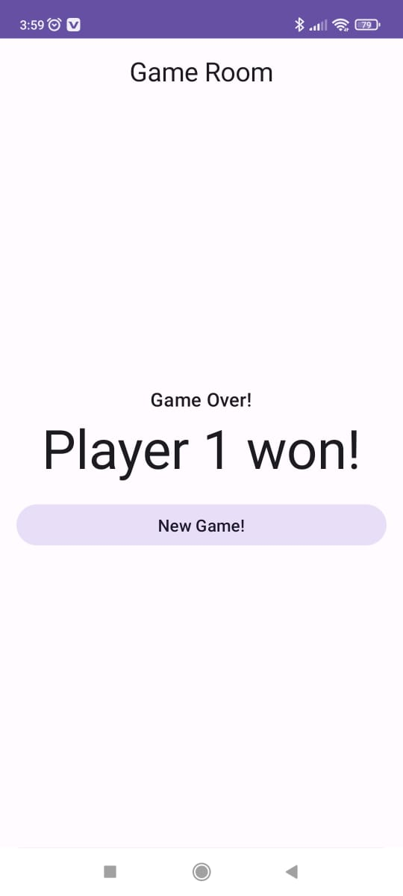

# Tic Tac Toe

Aplikasi permainan klasik Tic Tac Toe (juga dikenal dengan nama noughts and crosses) untuk perangkat Android dengan fitur bermain melalui Bluetooth.

## Tech Stack
 - [Kotlin](https://developer.android.com/kotlin#:~:text=Kotlin%20is%20a%20modern%20statically,developer%20satisfaction%2C%20and%20code%20safety.)
 - [Jetpack Compose](https://developer.android.com/jetpack/compose?gclid=Cj0KCQiA8t2eBhDeARIsAAVEga0bLIkdaoOTboP9SJ02x8y_CbI5IJKWgnwscwhJjuykIBBYcLlP3M4aAqsCEALw_wcB&gclsrc=aw.ds)

## Fitur
- Menggunakan bluetooth untuk bermain
- Tampilan yang sederhana dan mudah digunakan

## Persyaratan
- Perangkat Android version Nougat atau lebih baru
- Konektivitas Bluetooth aktif

## Cara bermain
1. Sambungkan perangkat Anda dengan perangkat lawan melalui Bluetooth
2. Mulai bermain dengan menandai kotak dengan X atau O
3. Pemain dengan tiga tanda berurutan (horizontal, vertikal, atau diagonal) akan memenangkan permainan

|   |   |
|---|---|
|   |   |
|   |   |
|   |   |

## Kontribusi
Kontribusi diterima dengan baik. Jika Anda ingin berkontribusi pada aplikasi ini, silakan buat pull request pada repositori GitHub.

## Lisensi
Aplikasi Tic Tac Toe dilisensikan dengan [Lisensi MIT](https://opensource.org/licenses/MIT).
